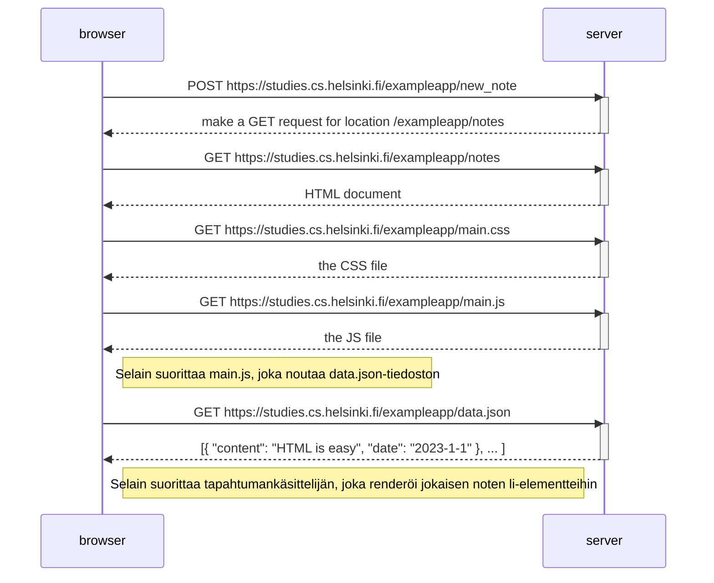
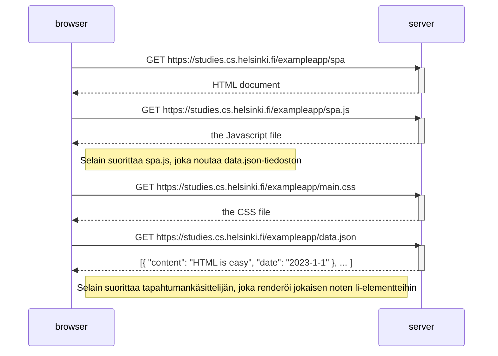
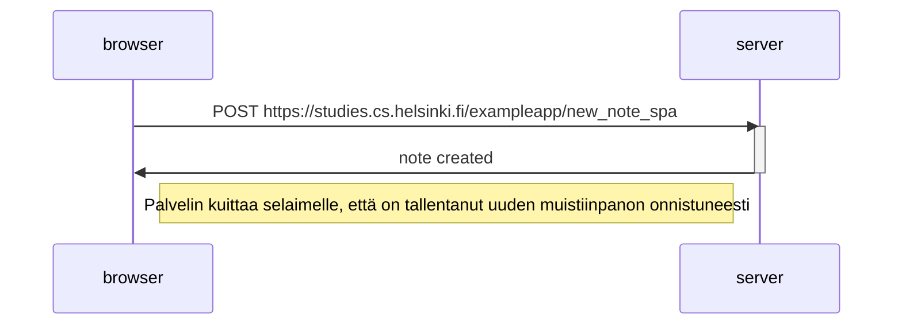

Tehtävä 0.4 uusi muistiinpano:

```mermaid
sequenceDiagram
    participant browser
    participant server

    browser->>server: POST https://studies.cs.helsinki.fi/exampleapp/new_note
    activate server 
    server-->>browser: make a GET request for location /exampleapp/notes 
    deactivate server

    browser->>server: GET https://studies.cs.helsinki.fi/exampleapp/notes
    activate server
    server-->>browser: HTML document 
    deactivate server
    
    browser->>server: GET https://studies.cs.helsinki.fi/exampleapp/main.css
    activate server
    server-->>browser: the CSS file
    deactivate server
    
    browser->>server: GET https://studies.cs.helsinki.fi/exampleapp/main.js
    activate server
    server-->>browser: the JS file
    deactivate server

    Note right of browser: Selain suorittaa main.js, joka noutaa data.json-tiedoston  

    browser->>server: GET https://studies.cs.helsinki.fi/exampleapp/data.json
    activate server
    server-->>browser: [{ "content": "HTML is easy", "date": "2023-1-1" }, ... ]
    deactivate server    

    Note right of browser: Selain suorittaa tapahtumankäsittelijän, joka renderöi jokaisen noten li-elementteihin 
```
Tehtävä 0.5 Single Page App:

```mermaid
sequenceDiagram
    participant browser
    participant server
    
    browser->>server: GET https://studies.cs.helsinki.fi/exampleapp/spa
    activate server
    server-->>browser: HTML document
    deactivate server
    
    browser->>server: GET https://studies.cs.helsinki.fi/exampleapp/spa.js
    activate server
    server-->>browser: the Javascript file
    deactivate server

    Note right of browser: Selain suorittaa spa.js, joka noutaa data.json-tiedoston  

    browser->>server: GET https://studies.cs.helsinki.fi/exampleapp/main.css
    activate server
    server-->>browser: the CSS file
    deactivate server
    
    browser->>server: GET https://studies.cs.helsinki.fi/exampleapp/data.json
    activate server
    server-->>browser: [{ "content": "HTML is easy", "date": "2023-1-1" }, ... ]
    deactivate server    

    Note right of browser: Selain suorittaa tapahtumankäsittelijän, joka renderöi jokaisen noten li-elementteihin 
```
Tehtävä 0.6 Uusi muistiinpano:

```mermaid
sequenceDiagram
    participant browser
    participant server
    
    browser->>server: POST https://studies.cs.helsinki.fi/exampleapp/new_note_spa
    activate server
    server->>browser: note created
    deactivate server

    Note right of browser: Palvelin kuittaa selaimelle, että on tallentanut uuden muistiinpanon onnistuneesti
```